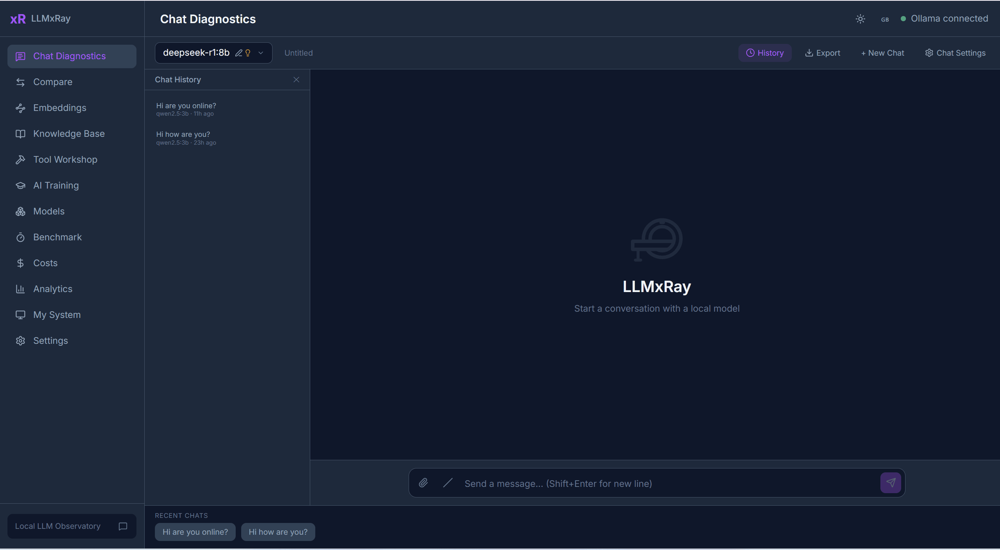
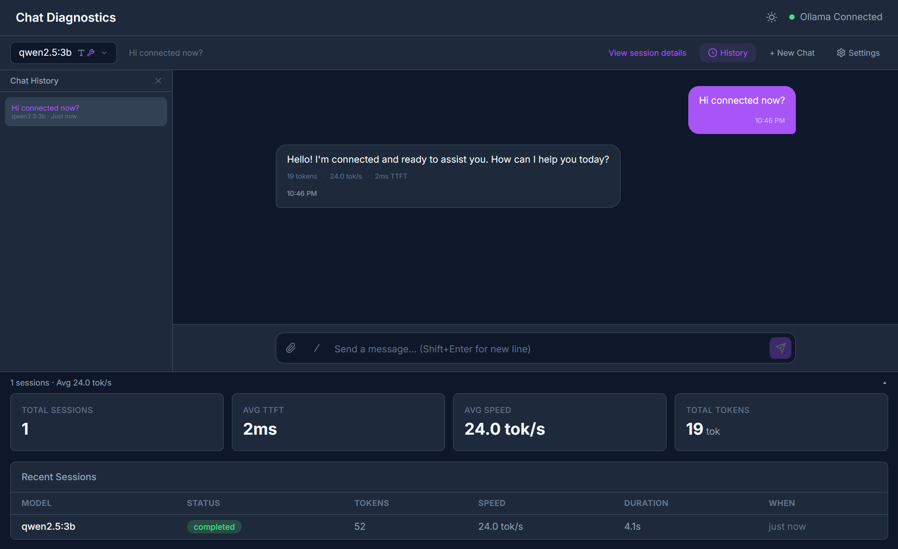
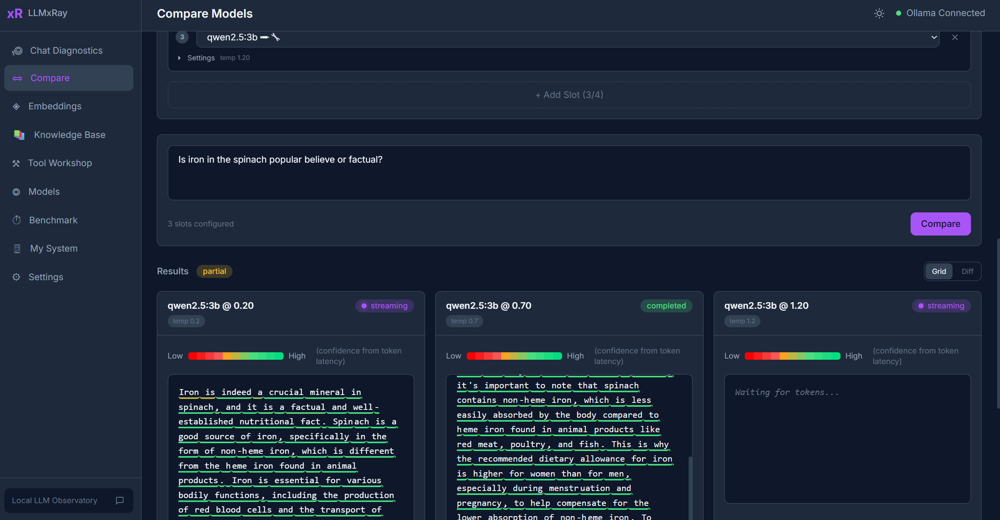
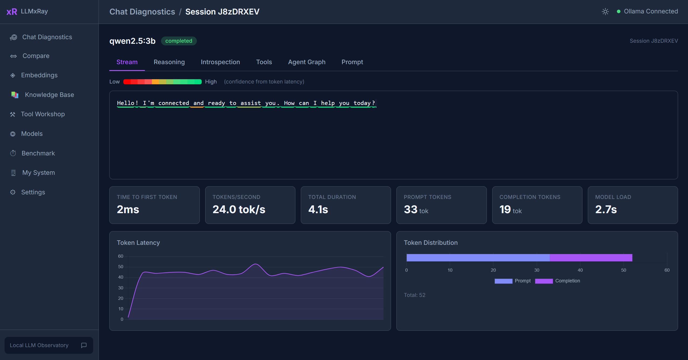
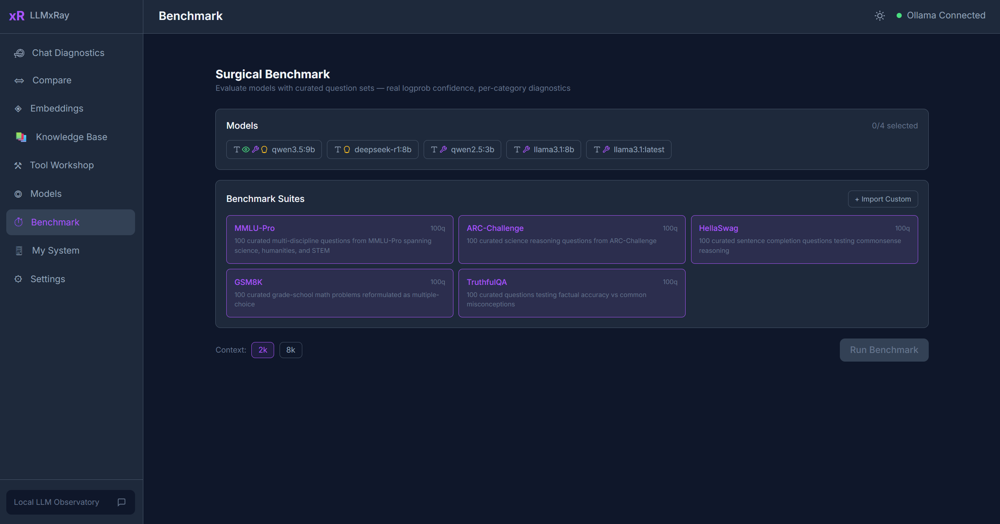
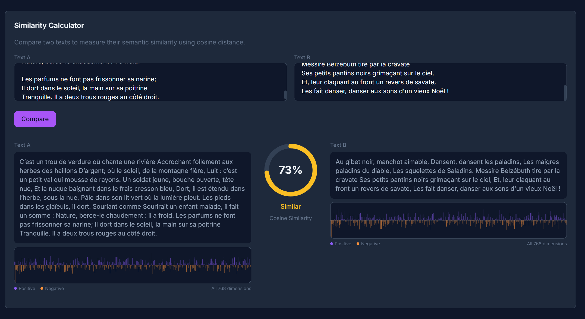
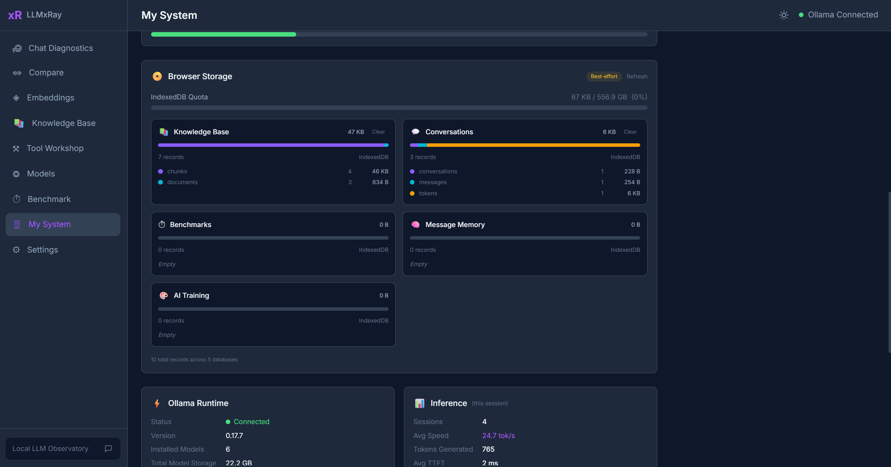

<p align="center">
  
</p>

<h1 align="center">LLMxRay</h1>
<p align="center"><strong>Voyez ce que votre IA fait réellement.</strong></p>
<p align="center">
  Streaming de tokens en temps réel, analyse de qualité, profilage des performances et suivi des coûts<br/>
  pour les LLM locaux. Pas de cloud. Pas de clés API. Pas de coût.
</p>

<p align="center">
  <a href="https://www.npmjs.com/package/llmxray"></a>
  <a href="https://hub.docker.com/r/djovaneli/llmxray"></a>
  
  
</p>

<p align="center">
  🌐 <a href="README.md">English</a> &bull;
  <strong>Français</strong> &bull;
  <a href="README.zh-CN.md">中文</a> &bull;
  <a href="README.ar.md">العربية</a> &bull;
  <a href="README.sr.md">Srpski</a>
</p>

<p align="center">
  <a href="#démarrage-rapide">Démarrage rapide</a> &bull;
  <a href="#fonctionnalités">Fonctionnalités</a> &bull;
  <a href="#captures-décran">Captures d'écran</a> &bull;
  <a href="#à-qui-ça-sadresse">À qui ça s'adresse</a> &bull;
  <a href="CHANGELOG.md">Changelog</a>
</p>

<p align="center">
  
</p>

---

## Démarrage rapide

**Une commande. 30 secondes.**

```bash
npx llmxray
```

Ou avec Docker :

```bash
docker run -p 5174:5174 djovaneli/llmxray
```

Ouvrez **http://localhost:5174** et commencez à discuter. C'est tout.

> **Prérequis :** [Ollama](https://ollama.com/download) lancé localement avec au moins un modèle téléchargé (`ollama pull llama3.2`).

---

## Pourquoi LLMxRay ?

Vous lancez un LLM local. Vous discutez avec lui. Mais que s'est-il réellement passé ?

- À quelle vitesse chaque token a-t-il été généré ? Pour lesquels le modèle était-il confiant ?
- La qualité des réponses se dégrade-t-elle au fil des longues conversations ?
- Combien ça aurait coûté en cloud ?
- Le modèle se répète-t-il ? Refuse-t-il ? Génère-t-il du charabia ?
- Comment la température 0,3 se compare-t-elle à 0,9 sur *le même* prompt ?

**LLMxRay répond à tout ça, visuellement, en temps réel, gratuitement.**

---

## Fonctionnalités

### Chat en temps réel avec intelligence par token
Discutez avec n'importe quel modèle Ollama et observez les tokens arriver avec une **coloration selon la confiance** — chaque token est teinté selon sa vitesse de génération. Supporte Markdown, conversations multi-tours, pièces jointes, modèles vision et commandes slash. Pour les modèles de raisonnement, réglez le budget de réflexion par conversation — désactivé, au choix du modèle, ou un effort explicite faible / moyen / élevé / max.

### Filtres qualité des réponses
Chaque réponse est analysée automatiquement. Des badges colorés n'apparaissent que lorsqu'il y a un problème :
- **Répétition** — phrases répétées excessivement (analyse 4-gram)
- **Refus** — "en tant que modèle de langage" et 7 autres motifs
- **Charabia** — taux élevé de caractères non-ASCII
- **Vide** — moins de 10 mots
- **Tronqué** — limite de tokens atteinte sans conclusion

### Atelier de comparaison de modèles
Jusqu'à **4 emplacements** avec modèle, température et prompt système indépendants. Streaming côte à côte, surlignage des différences au niveau du mot, comparaison de métriques, et préréglages en un clic (Balayage de température, Paire déterministe, Comparaison de langues avec visualisation de la taxe sur les tokens).

### Analytiques de performance
- **Percentiles de latence** (P50/P95/P99) pour la durée et le TTFT
- **Intelligence des erreurs** — classificateur en 7 catégories avec timeline
- **Heatmap d'utilisation** — grille 7×24 de vos heures actives
- **Impact des paramètres** — nuages de points température vs tokens/sec
- Suivi **démarrage à froid vs à chaud** avec historique de chargement des modèles

### Tableau de bord des coûts
Consommation de tokens par modèle/jour avec estimation du prix équivalent en cloud. Voyez ce que vous *économisez* en restant local.

### Benchmark chirurgical
Testez les connaissances d'un modèle avec des suites de questions à choix multiples. Utilise les vrais logprobs via l'endpoint compatible OpenAI pour une mesure précise de la confiance. Créez des suites personnalisées visuellement ou laissez l'IA les générer à partir d'un sujet.

### Laboratoire d'embeddings et pipeline RAG
Embeddez du texte, visualisez les vecteurs, mesurez la similarité cosinus. Demandez un vecteur de sortie plus étroit pour voir ce que coûte la troncature Matryoshka en similarité. Construisez une base de connaissances locale à partir de PDF, DOCX et CSV — découpée, embeddée, recherchable. Stockée dans IndexedDB. Coût zéro.

### Atelier d'outils (canvas visuel)
Canvas à nœuds en drag-and-drop pour construire des définitions d'outils. Synchronisation bidirectionnelle du code (modifiez les nœuds ou le TypeScript — les deux se mettent à jour). Sondez des APIs, générez des schémas automatiquement, testez avec exécution en direct.

### Aire de jeu Fill-in-the-Middle *(nouveau en v0.4.7)*
Complétion de code pour Qwen-Coder, CodeLlama, Codestral, DeepSeek-Coder et StarCoder. Deux zones de texte (préfixe / suffixe), le modèle remplit le trou. Utilise le champ `suffix` d'Ollama sur `/api/generate`. L'aperçu assemblé montre le résultat tel qu'il apparaîtrait dans votre éditeur.

### Observatoire de protocoles *(nouveau en v0.4.7)*
Envoyez le même prompt à travers les trois protocoles de service d'Ollama — **natif** `/api/chat`, **compatible OpenAI** `/v1/chat/completions`, et **compatible Anthropic** `/v1/messages` — en parallèle contre votre modèle local. Streaming côte à côte, métriques par protocole, et onglet « envelope diff » qui montre comment chaque protocole encode les raisons de fin, le comptage de tokens et les enveloppes d'erreur. Pas de cloud, pas de clés API — les trois endpoints sont locaux sur `localhost:11434`.

### Pipeline d'entraînement IA
Préparez des données d'entraînement à partir de vos conversations. Étiquetez, révisez et exportez en JSONL pour le fine-tuning.

### Base de données d'historique IA locale
Chaque expérience (benchmarks, comparaisons, chats, paires d'entraînement) est archivée automatiquement dans une base IndexedDB requêtable avec filtres, tendances, exports et politiques de rétention.

### Multilingue
Traductions complètes en anglais, français, serbe (latin + cyrillique), chinois et arabe. Support du layout RTL. Scaffolds communautaires pour l'hébreu et le japonais.

---

## Compatibilité Ollama

Testé et vérifié avec **Ollama 0.32.x** (la version stable la plus récente en août 2026). LLMxRay utilise les endpoints Ollama suivants :

| Endpoint | Utilisation |
|---|---|
| `/api/chat` | Chat streaming (NDJSON, avec `tools`, `think`, schema `format`) |
| `/api/generate` | Génération + Fill-in-the-Middle via `suffix` |
| `/api/tags` | Liste des modèles + capacités, longueur de contexte et largeur d'embedding |
| `/api/show` | Paramètres, template, licence et métadonnées d'architecture |
| `/api/embed` | Embeddings vectoriels pour RAG |
| `/api/pull`, `/api/delete`, `/api/ps`, `/api/version` | Gestion et statut des modèles |
| `/v1/chat/completions` | Chemin compatible OpenAI utilisé par le Benchmark chirurgical pour les vrais logprobs |
| `/v1/messages` | Chemin compatible Anthropic utilisé par l'Observatoire de protocoles |

**Compatible avec :** Ollama 0.20 et plus récent (les versions antérieures fonctionnent pour chat/generate mais sans `think` ni `format` JSON-schema). **Recommandé :** Ollama 0.32+ — les capacités et la longueur de contexte arrivent avec la liste des modèles, `think` accepte des niveaux d'effort gradués, et les embeddings acceptent une largeur `dimensions`.

---

## Captures d'écran

<table>
<tr>
<td width="50%">

**Chat avec streaming de tokens et confiance**


</td>
<td width="50%">

**Comparaison de modèles — côte à côte**


</td>
</tr>
<tr>
<td width="50%">

**Analyse approfondie d'une session — métriques et timing**


</td>
<td width="50%">

**Benchmark avec radar de confiance**


</td>
</tr>
<tr>
<td width="50%">

**Embeddings — similarité cosinus**


</td>
<td width="50%">

**Moniteur système — matériel et statut Ollama**


</td>
</tr>
</table>

---

## À qui ça s'adresse

| Vous êtes... | LLMxRay vous aide à... |
|---|---|
| **Développeur** | Déboguer des prompts, profiler la latence, comparer des modèles, inspecter des appels d'outils, suivre les coûts |
| **Chercheur** | Mener des expériences contrôlées avec des paramètres cohérents entre modèles et températures |
| **Étudiant / Enseignant** | Explorer le comportement des modèles visuellement — Kit Éducateurs intégré avec 9 modules interactifs |
| **Responsable d'équipe IA** | Comprendre les tendances de qualité, les motifs d'erreurs et l'utilisation des ressources sur votre parc local |

---

## Options d'installation

### npx (recommandé)
```bash
npx llmxray
npx llmxray --port 3000
npx llmxray --ollama-url http://192.168.1.50:11434
```

### Docker
```bash
docker run -p 5174:5174 djovaneli/llmxray
docker run -p 5174:5174 -e OLLAMA_URL=http://host.docker.internal:11434 djovaneli/llmxray
```

### Depuis les sources
```bash
git clone https://github.com/LogneBudo/llmxray.git
cd llmxray
npm install
npm run dev     # http://localhost:5173
```

---

## Stack technique

| Couche | Technologie |
|---|---|
| Framework | Vue 3.5 + Composition API |
| Langage | TypeScript 5.9 (strict) |
| Build | Vite 7.3 |
| Style | Tailwind CSS 4.2 |
| État | Pinia 3 (store par domaine) |
| Graphiques | Chart.js 4, D3.js 7 |
| Canvas | Vue Flow (éditeur de nœuds visuel) |
| Éditeur de code | CodeMirror 6 |
| Stockage | IndexedDB (natif au navigateur) |
| Backend LLM | Ollama (local) |

---

## Architecture

**Streaming** — Lit le NDJSON d'Ollama via `fetch()` + `ReadableStream`. Les tokens mettent à jour l'UI de manière réactive à travers les stores Pinia.

**Confiance des tokens** — Approximée à partir de la latence inter-tokens (plus rapide = plus confiant). Clairement étiquetée comme approximation. Les benchmarks utilisent les vrais logprobs via l'endpoint compatible OpenAI.

**Store par domaine** — Chaque domaine a son propre store Pinia : tokens, sessions, métriques, raisonnement, comparaison, embeddings, qualité, coût et plus.

**Détection matérielle** — Plugin Vite personnalisé qui interroge l'OS directement (PowerShell/proc/sysctl) pour des spécifications matérielles précises.

---

## Développement

| Commande | Ce qu'elle fait |
|---|---|
| `npm run dev` | Serveur de dev (port 5173) |
| `npm run build` | Vérification de types + build de production |
| `npm run test` | Tests unitaires (Vitest) |
| `npm run test:e2e` | End-to-end (Playwright) |

---

## Contribuer

Les contributions sont les bienvenues ! Voir [CONTRIBUTING.md](CONTRIBUTING.md) pour la configuration et les directives.

**Les traductions communautaires sont particulièrement bienvenues** — fichiers scaffolds prêts pour l'hébreu et le japonais.

---

## Licence

[Apache License 2.0](LICENSE)

## Marque

**LLMxRay** est une marque d'Ivan Stankovic ([LogneBudo](https://github.com/LogneBudo)). Voir [TRADEMARK.md](TRADEMARK.md).

---

<p align="center">
  <strong>Si LLMxRay vous aide à mieux comprendre votre IA, pensez à lui donner une étoile.</strong><br/>
  Ça aide d'autres personnes à découvrir le projet.
</p>

<p align="center">
  <a href="https://github.com/LogneBudo/llmxray">
    
  </a>
</p>
